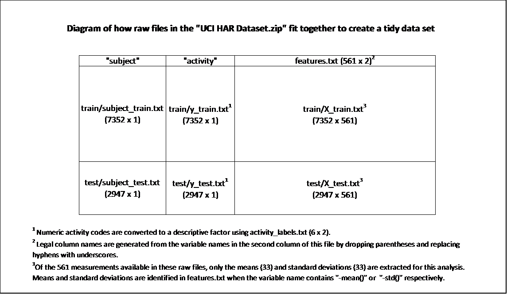

## Project Description
Assemble, extract and aggregate select statistics from the "Human Activity Recognition Using Smartphones" raw data

##Study Design and Data Processing

###Collection of the raw data
The input files to this processing script are from a zip file "UCI HAR Dataset.zip" which is published on the following University of California Irving web page:
http://archive.ics.uci.edu/ml/datasets/Human+Activity+Recognition+Using+Smartphones

The README.TXT within the zip file explains how the data were collected and the features_info.txt file explains how the metrics contained in the raw files were generated.

NOTE:  The features.txt file contains 84 duplicate feature names.  These can be displayed after the script is run using this R command:  
```
HARlabels[duplicated(HARlabels[,2]),]  
```
The associated values in the measurement files for those duplicate labels are not identical, so if the R script is modified to extract different columns of statistics, the results may be unexpected.

##Creating the tidy datafile
This document describes the tidy data set generated from the raw files containing the averages of selected measurements for each subject and activity in the study.

###Guide to create the tidy data file
The following diagram illustrates how eight raw files are used to construct the wide, tidy data set.



The zip file should be downloaded from the web and extracted to an empty directory in such a way that the internal directory structure is maintained.  The zip file contains parallel directories of files encoded for both Mac and Windows operating systems.  While this script was specifically developed and tested to run on Windows OS it should also work transparently on Mac OS.  

The R working directory should be set to the top extracted directory.  

The R package reshape2 must be loaded. 

###Cleaning of the data
Running the R script accomplishes these tasks:  
1. Merge the training and test files to create one data set  
2. Extract only the mean and standard deviation statistics  
3. Generate descriptive labels for the selected statistics based on the original feature names  
4. Add the identification variables "subject" and "activity" to the data set  
5. Calculate the average of each extracted measurement for each subject and activity  
6. Write the summary data set to the working directory as a text file  

[Refer to the README.md document for further details of the R code which produces the summary data set.](https://github.com/pfurrow/GetCleanDataClassProject/blob/master/README.md)

##Description of Variables 
The "HAR Tidy Dataset of Means.txt" file contains:
* 180 rows of statistics for 30 subjects performing 6 activities
* Each row contains 68 variables
   + 2 identification variables (factors)
   + 66 measurement variables (numeric)

###Identification Variables

Col Name | Levels | Description
------- |----|-----|------
subject | 1-30 | An integer identifying the subject who performed the activity
activity | 1-6 | A text descriptor of the activity the subject performed
 | | |     Levels: LAYING SITTING STANDING WALKING WALKING_DOWNSTAIRS WALKING_UPSTAIRS

###Measurement Variables
All 66 of the measurement variables are numeric averages of extracted mean and standard deviation metrics for each subject and activity.  The variable naming convention is consistent with the original feature labels of the data set except parentheses have been removed and hyphens are replaced with underscores to make legal column names.  The variable name is composed of several descriptive elements:

Signal Domain | Acceleration Source | Instrument | Calculation | Statistic | 3-axial Signals  
------- | ----|----|-----|------|----
t = time | Body | Acc = accelerometer | Jerk = time derivation | mean = mean | X = x direction
f = frequency | Gravity | Gyro = gyroscope | Mag = magnitude | std = std deviation |Y = y direction
  |   |   |   | Z = z direction

All variables have one of two units of measure:

Instrument | Unit of measure
-----------------|--------------
accelerometer ("Acc" in variable name)| g's or meters per second squared (m/s^2^)
gyroscope ("Gyro" in variable name) | radian per second (rad/s)
